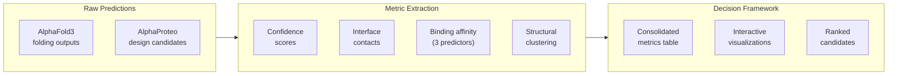
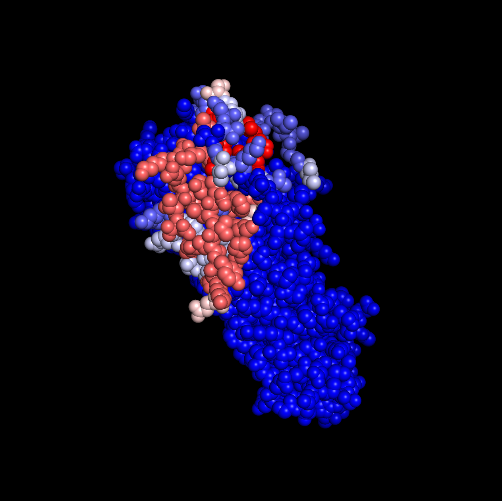

# AlphaProteo Bacterial Toxin Antidote Decision-Making Pipeline

## The Problem

Generative protein design tools like AlphaProteo can produce thousands of candidate binder designs in a single run. For each candidate, AlphaFold3 generates multiple folding scenarios (binder-target, binder alone, multimeric contexts), each with its own set of confidence metrics, structural coordinates, and interface predictions. The result is a combinatorial explosion of data: hundreds of designs, each with dozens of metrics, spread across tens of thousands of files.

The core challenge is not generating candidates -- it is **deciding which ones to make**. With limited experimental bandwidth, every slot on the plate matters. This pipeline was built to turn raw structural predictions into a ranked, clustered, and visually interpretable decision framework for selecting AlphaProteo-designed protein binders against bacterial toxins.

## Approach

The pipeline operates in two phases:

**Phase 1 -- Metric Extraction and Consolidation.** Each design's AlphaFold3 outputs are parsed for structural confidence scores (iPTM, pTM, ranking confidence), interface contact residues, and structural alignment quality (RMSD). Three independent binding affinity predictors (PyRosetta, PPI-Graphormer, PRODIGY) are run on every structure. FoldSeek performs structural clustering to group designs by 3D similarity rather than sequence. All metrics are consolidated into a single table where each row is a design and each column is a measurable property.

**Phase 2 -- Analysis and Visualization.** Dimensionality reduction (PCA, UMAP) reveals the structure of the design space. Correlation analysis identifies which metrics are redundant and which carry independent signal. FoldSeek clustering is tested across a range of sensitivity parameters to find clusters that are robust to algorithmic choices. Binding affinity predictions are cross-referenced against cluster membership and structural confidence to identify designs that score well across multiple independent measures.

The key insight driving the analysis design: **no single metric is trustworthy on its own**. Predicted binding affinity can be noisy. Structural confidence can be high for designs that don't actually bind. Clustering can be sensitive to parameters. The pipeline's value is in integrating all of these signals and surfacing designs where multiple lines of evidence converge.



## Interactive Outputs

The pipeline produces interactive visualizations designed to support multi-criteria decision-making. Each plot is a self-contained Plotly HTML file.

> **[Browse all visualizations](https://jahoffman91.github.io/AI_binder_analysis_pipeline/)**

| Visualization | What it shows |
|:---|:---|
| [Cluster Affinity Network](https://jahoffman91.github.io/AI_binder_analysis_pipeline/interactive_affinity_network.html) | Designs as nodes, edges where pairs consistently co-cluster across FoldSeek parameter sweeps. Node color toggles between affinity rank, experimental pass/fail, and iPTM. Reveals which structural clusters contain the most promising candidates. |
| [Cluster Affinity Scatter](https://jahoffman91.github.io/AI_binder_analysis_pipeline/cluster_affinity_scatter_chart.html) | Every design plotted by its ultra-stable cluster, with combined affinity rank and iPTM on toggle. Quickly identifies clusters where most members score well vs. clusters with high variance. |
| [Cluster Affinity Breakdown](https://jahoffman91.github.io/AI_binder_analysis_pipeline/cluster_affinity_bar_chart.html) | Per-cluster view of all three binding affinity predictors (PRODIGY, PyRosetta, PPI-Graphormer) alongside structural confidence. Shows where predictors agree and where they diverge. |
| [Robustness Network](https://jahoffman91.github.io/AI_binder_analysis_pipeline/interactive_network_graph.html) | Tests whether cluster assignments are stable across FoldSeek sensitivity/coverage parameters. Adjustable threshold slider shows which design pairs always cluster together vs. which are borderline. |

### Target Contact Heatmap

Per-residue contact frequency mapped onto the target protein surface. Red indicates residues frequently contacted by designed binders across ultra-stable clusters; blue indicates rarely contacted regions. This reveals the preferred binding hotspots that top-performing designs converge on.

<p align="center">
  
</p>

<p align="center">
  <a href="https://github.com/jahoffman91/AI_binder_analysis_pipeline/raw/main/docs/assets/Heatmap_animation.mp4">Watch the animated version</a> — cycles through each ultra-stable cluster to show how contact patterns shift.
</p>

---

## Technical Details

<details>
<summary>Pipeline steps and configuration</summary>

### Processing Pipeline (13 steps)

| Step | Description | External tool |
|------|-------------|---------------|
| 1 | Extract AF3 confidence metrics (iPTM, pTM, ranking) | -- |
| 2 | Sequence length analysis | -- |
| 3 | Contact residue analysis (interface contacts, amino acid frequencies) | BioPython |
| 4-6 | Structural alignment via PyMOL + RMSD parsing | PyMOL |
| 7 | RMSD consolidation | -- |
| 8 | Interface energy / Kd estimation | PyRosetta |
| 9 | ML-based binding affinity | PPI-Graphormer |
| 10 | Physics-based binding affinity | PRODIGY |
| 11 | Consolidate all metrics into single table | -- |
| 12 | Generate HTML report | -- |
| 13 | FoldSeek structural clustering | FoldSeek |

### Analysis Pipeline (12 steps)

| Step | Description |
|------|-------------|
| 1-3 | PCA and UMAP dimensionality reduction |
| 4-5 | Pearson/Spearman correlation analysis + interactive heatmaps |
| 6-7 | FoldSeek sensitivity curves + cluster pass-rate analysis |
| 8-9 | Contact residue heatmaps + multi-model cluster PDBs |
| 10-12 | Affinity prediction analysis + interactive network/scatter plots |

### Running the pipeline

```bash
pip install -r requirements.txt
# Edit config.yaml to set your input paths and tool locations
python -m pipeline list-steps          # Show steps and completion status
python -m pipeline run --phase all     # Run everything
python -m pipeline run --phase analysis --steps 1,2,3  # Run specific steps
python -m pipeline run --phase all --dry-run            # Preview without executing
```

### Configuration

All paths, tool locations, and parameters are in `config.yaml`. Steps requiring external tools (PyMOL, PyRosetta, PPI-Graphormer, PRODIGY, FoldSeek) can be individually disabled. See [docs/installation.md](docs/installation.md) for tool installation instructions.

</details>

<details>
<summary>Expected input/output structure</summary>

### Inputs

```
Inputs/
  AP_submissions_key.csv          # Design metadata with Sequence column
  All_fold_results/               # AlphaFold3 folding outputs (CIF + JSON per design)
  All_pdb_results/                # PDB-format structure files
  AP_results/                     # AlphaProteo original predictions (mmCIF)
```

### Outputs

```
Outputs/
  consolidated_data/
    all_metrics_consolidated.csv  # Central table: one row per design, all metrics as columns
  performance_metrics/            # iPTM, pTM, ranking scores
  contact_analysis/               # Interface contact features
  binding_strength_prediction/    # PyRosetta, PPI-Graphormer, PRODIGY results
  foldseek_clustering/            # Structural cluster assignments

Analysis_Outputs/
  PCA_Analysis/                   # Dimensionality reduction
  UMAP_Analysis/                  # UMAP embeddings
  Correlation_Analysis/           # Correlation matrices
  Affinity_Analysis/              # Cross-method affinity rankings
  Contact_Analysis/               # Per-target contact heatmaps
  Robustness_Analysis_.../        # Cross-parameter cluster stability
```

</details>
