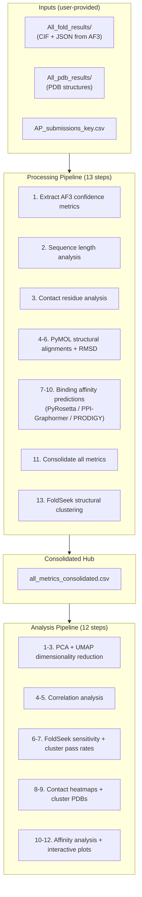

# AlphaProteo Bacterial Toxin Antidote Decision-Making Pipeline

A computational pipeline for evaluating AlphaProteo-designed protein binders against bacterial toxins. Starting from AlphaFold3 folding results, it consolidates structural confidence metrics, binding affinity predictions, contact residue analysis, and structural clustering into a single decision-making framework.

## Interactive Outputs

> **[View all interactive visualizations on GitHub Pages](https://github.com/)**

<table>
<tr>
<td width="50%">

**Cluster Affinity Network**
Design clusters connected by stable co-clustering pairs, colored by binding affinity rank and iPTM.

</td>
<td width="50%">

**Cluster Affinity Scatter**
Per-design affinity predictions across ultra-stable FoldSeek clusters with iPTM overlay.

</td>
</tr>
</table>

### Target Contact Heatmap Animation

Per-residue contact frequency across the target protein, animated by ultra-stable cluster:

<video src="docs/assets/Heatmap_animation.mpg" controls autoplay loop muted width="720"></video>

---

## Pipeline Architecture



## Quick Start

### 1. Install Python dependencies

```bash
pip install -r requirements.txt
# or with conda:
conda env create -f environment.yml
conda activate alphaproteo-pipeline
```

### 2. Install external tools

The pipeline uses several structural biology tools. See [docs/installation.md](docs/installation.md) for detailed instructions. Steps that require unavailable tools can be disabled in `config.yaml`.

| Tool | Steps | Required? |
|------|-------|-----------|
| FoldSeek | Processing 13, Analysis 6-7 | Recommended |
| PyMOL | Processing 4-7 | Optional |
| PyRosetta | Processing 8 | Optional |
| PPI-Graphormer | Processing 9 | Optional |
| PRODIGY | Processing 10 | Optional |

### 3. Configure paths

Edit `config.yaml` to point to your data:

```yaml
paths:
  working_dir: "."
  inputs_dir: "Inputs"
  all_fold_results: "Inputs/All_fold_results"
  all_pdb_results: "Inputs/All_pdb_results"
  ap_submissions_key: "Inputs/AP_submissions_key.csv"

tools:
  pymol_path: "pymol"
  foldseek_path: "foldseek"
```

### 4. Run the pipeline

```bash
# See available steps and their completion status
python -m pipeline list-steps

# Run everything
python -m pipeline run --phase all

# Run only the processing pipeline
python -m pipeline run --phase processing

# Run specific analysis steps
python -m pipeline run --phase analysis --steps 1,2,3

# Dry run (show commands without executing)
python -m pipeline run --phase all --dry-run

# Force re-run of completed steps
python -m pipeline run --phase analysis --steps 8 --force
```

## Expected Input Structure

```
Inputs/
  AP_submissions_key.csv          # Design metadata with Sequence column
  All_fold_results/               # AlphaFold3 folding outputs
    ap_s1_1_b1t1/                 # One folder per design x binding scenario
      ap_s1_1_b1t1/
        ap_s1_1_b1t1_summary_confidences.json
        ap_s1_1_b1t1_model.cif
    ap_s1_1_b1t2/
      ...
  All_pdb_results/                # PDB-format structure files
    ap_s1_1_b1t1_model.pdb
    ...
  AP_results/                     # AlphaProteo original predictions (mmCIF)
```

## Output Structure

```
Outputs/
  performance_metrics/            # iPTM, pTM, ranking scores per design
  contact_analysis/               # Interface contact features
  alignments/                     # PyMOL scripts and RMSD logs
  rmsd_results/                   # Consolidated RMSD values
  binding_strength_prediction/    # PyRosetta, PPI-Graphormer, PRODIGY results
  foldseek_clustering/            # Structural cluster assignments
  consolidated_data/
    all_metrics_consolidated.csv  # Central table joining all metrics
  reports/                        # HTML report + executive summary

Analysis_Outputs/
  PCA_Analysis/                   # Principal component analysis
  UMAP_Analysis/                  # UMAP embeddings and plots
  Correlation_Analysis/           # Pearson/Spearman correlation matrices
  Affinity_Analysis/              # Affinity vs. pass-rate rankings
  Contact_Analysis/               # Per-target contact heatmaps
  Cluster_PDBs/                   # Multi-model PDB files per cluster
  Robustness_Analysis_.../        # Cross-parameter cluster stability
```

## Configuration Reference

All configurable parameters live in `config.yaml`:

| Section | Key | Default | Description |
|---------|-----|---------|-------------|
| `paths` | `working_dir` | `.` | Project root directory |
| `tools` | `pymol_path` | `pymol` | Path to PyMOL executable |
| `tools` | `foldseek_path` | `foldseek` | Path to FoldSeek binary |
| `params` | `contact_distance` | `5.0` | Contact distance threshold (angstroms) |
| `params` | `design_pattern` | `*b1t1_model.pdb` | Glob pattern for design PDB files |
| `params` | `ppi_graphormer_device` | `mps` | Compute device (`mps`, `cuda`, `cpu`) |
| `pipeline` | `processing_steps.N.enabled` | `true` | Enable/disable individual steps |

## License

[Add license information here]
